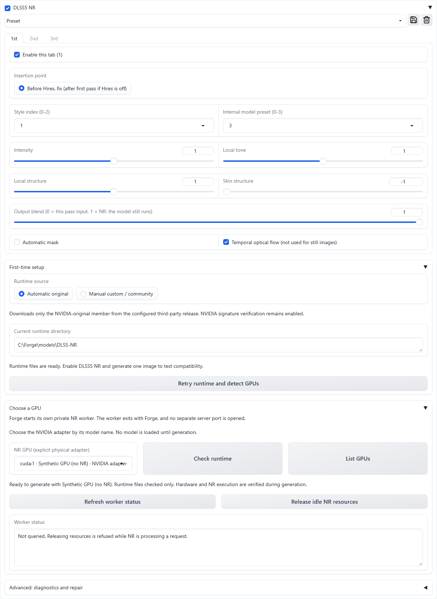

# DLSS5 NR for Forge

[简体中文](README.zh-CN.md) | [Runtime / model setup](MODEL_SETUP.md)

An **experimental, unofficial** NVIDIA Neural Rendering extension for **Forge-neo on Windows**.
Enhance generated still images with up to three separately configured NR passes before or after Hires. fix, or after img2img sampling,
with an always-visible header switch, named presets and X/Y/Z comparisons. The panel follows Forge's interface language automatically;
English and Simplified Chinese are supported, with no separate language selector.
The separate top-level **DLSS5 NR** tab also enhances uploaded images directly, without diffusion sampling or a VAE round trip.



**Automatic runtime source:** the third-party
[Magpie v0.6.6-experimental release](https://github.com/SAOG0721/Magpie/releases/tag/v0.6.6-experimental).
The downloader fetches its archive and extracts only `NVIDIA-Original/nvngx_dlssnr.dll`, then verifies the NVIDIA signature.
Manual custom/community runtimes are supported separately. This project's releases contain only the MIT bridge and its notices, not the NVIDIA runtime.
See [runtime preparation](MODEL_SETUP.md) for the source and manual installation options.
This is not NVIDIA Super Resolution, Ray Reconstruction or a general DLSS SDK installer.

## Features

- A top-level **DLSS5 NR** tab beside txt2img/img2img: upload a still image, enhance it directly, compare the result and download a PNG.
  It has its own cancel button and parameters; it does not use Forge's global interrupt or load a diffusion checkpoint.
- Header checkbox: enable/disable NR while the panel is collapsed. Off leaves native generation untouched.
- **1st / 2nd / 3rd tabs**, each with its own enable switch, insertion point and parameters. Only the first tab starts enabled.
- In txt2img, enabled before-hires tabs run in tab order, followed by upscaling/hires sampling, then enabled after-hires tabs in tab order.
  Without Hires. fix, only before-hires is available. All NR passes finish before ADetailer.
- An independent **img2img** panel runs enabled tabs in order after sampling and latent callbacks, before face restoration and mask compositing.
  Nested ADetailer redraws do not repeat NR. Uploaded inputs and denoising strength are not changed by NR.
- Per-tab style/preset indices, intensity, tone, structure, skin, automatic mask and output blend.
  Copy the previous tab's parameters without changing this tab's enable switch.
- Named parameter presets; `[DLSS5 NR] Enabled` and `[DLSS5 NR] Preset` axes in **X/Y/Z plot**.
  Presets store all three tabs but never change the master switch or GPU. Grid presets are frozen before the grid begins.
- Explicit physical GPU selection. NR never unloads other applications' models, guesses another GPU or silently reduces quality.
- A private process isolates native runtime failures and exits with Forge, including abrupt Forge exits on Windows.
- Automatic-original and manual-custom runtime modes use separate directories. Your manual file is never automatically downloaded or replaced.

## Requirements

- 64-bit Windows; Forge-neo with Python **3.12 or 3.13**. Other WebUI forks are not claimed compatible.
- Compatible NVIDIA GPU/driver and NR runtime. Tested: **RTX 5060 Ti, driver 610.62,
  unmodified NVIDIA 310.8.0.0 runtime**. RTX 40/community runtime compatibility has not been tested here; use the explicit manual mode for your own compatible file.
- A network connection for the small private Python dependencies, this project's MIT bridge and the automatic runtime download.
- Visual Studio is **not** needed for the prebuilt bridge. It is needed only to rebuild the native source yourself.

The tested still-image GPU allocation was about 0.5 GiB at 832x1216 and 0.9 GiB at 2048x2048.
These are observations, not minimum-memory guarantees. Full cards can still fail or become slow.

## Install

Repository URL (no GitHub access token required):

```text
https://github.com/silvermoong/sd-webui-forge-dlss5-nr.git
```

1. Check that normal generation works in **Forge-neo** and that its startup log shows Python **3.12 or 3.13**.
2. Open **Extensions -> Install from URL**, paste the repository URL above, leave other fields at their defaults,
  and click **Install**. Dependency preparation starts at this point.
3. Open **Installed -> Apply and restart UI** after active jobs finish. A browser refresh is not this operation.
4. Return to **txt2img** or **img2img** and expand **DLSS5 NR**. **First-time setup** is below the three parameter tabs.
  **Automatic original** prepares a missing runtime and shows download progress.
  For an interrupted download, use **Retry runtime and detect GPUs**. Missing dependencies require
  **Advanced: diagnostics and repair -> Repair dependencies and continue**; ordinary retries do not install Python packages.
5. Click **List GPUs** and select your NVIDIA adapter by model name. The runtime retry button already lists devices.
  Continue once **Ready to generate with ...** appears. No model is loaded by listing devices.

The runtime is stored in **`DLSS-NR` inside Forge's model directory**, normally `models/DLSS-NR`.
Forge's custom model directory is respected. The plugin keeps its own Python dependencies and never replaces Forge's Torch installation.
The **Installed** message alone is not proof that dependencies or the NR runtime are ready.

## Manual / Community Runtime

1. In **Runtime source**, choose **Manual custom / community**. This disables automatic runtime downloading, including after restarting Forge.
2. Under **Advanced: diagnostics and repair**, select your `nvngx_dlssnr.dll` and click **Import runtime copy**.
  Alternatively, place it in the displayed directory, normally `models/DLSS-NR/manual`, and click **Retry runtime and detect GPUs**.
3. Select the intended GPU and test one image. Switching back to **Automatic original** preserves your manual file.

Manual files are checked for local Windows x64 DLL format and copy integrity, not NVIDIA signature or safety.
Use only code you trust. RTX 40 compatibility depends on your chosen community runtime and driver; an import is not a compatibility test.
Switching modes and importing files require an idle private controller. Existing different files are preserved, not silently overwritten.

## First Test

Use a model and prompt that already generate correctly. Set **512x512, batch size 1, batch count 1**, temporarily disable Hires. fix
and ADetailer, keep only **1st** enabled with default parameters, enable **DLSS5 NR** in its header and click the usual **Generate** button.

Success means a normal output image whose generation parameters contain a `DLSS5 NR` receipt with `status: done`.
File readiness is not GPU/runtime compatibility validation. On failure, disabling DLSS5 NR restores normal generation;
follow the recovery action shown in the preparation message instead of deleting models or reinstalling Forge.
An unavailable release download is a publisher/source problem, not a reason to reinstall Forge.

Dependency repair closes only this extension's confirmed-idle controller before reinstalling its dependencies.
It refuses to run during an NR request or while the controller's state is unknown. Short messages appear in **First-time setup**;
original errors are available under **Diagnostic details** in the Advanced section and clear after a successful preparation.

## Three-Pass Setup

After a successful single-pass test, open **2nd** or **3rd**, enable that tab and set its parameters and insertion point.
Each pass can use the same values or different ones. Switching tabs only changes the editor view; it does not run NR or select which pass executes.
Disabled tabs keep their values but do not run. Disabling all tabs leaves native generation untouched, even with the master switch on.

In txt2img, the stages determine execution order. For example, with tab 2 before hires and tabs 1 and 3 after hires:

```text
First sampling -> NR tab 2 -> Upscale / hires sampling -> NR tab 1 -> NR tab 3 -> Face restoration / ADetailer
```

**Copy previous tab parameters** copies parameters and insertion point, not the tab's enable switch.
Each **Output blend** mixes NR with that pass's input, then sends the mixed result to the next pass; `0` still runs the model.
Passes use the same runtime and GPU. Intermediate images within one stage stay in float32; stage file boundaries remain 8-bit sRGB PNG.

More passes cost additional processing and can amplify changes to lighting, structure or identity. Three passes are not a guaranteed quality improvement
or equivalent to tripling intensity. Start with one pass and compare. After updating an installed extension, wait for active jobs to finish and restart Forge;
a browser refresh alone does not reload the Python implementation.

## Direct Image Enhancement

1. Open the top-level **DLSS5 NR** tab, next to txt2img and img2img.
2. Upload one still image. Prepare the runtime and select the NR GPU in this tab; the runtime files and private worker are shared with the other panels.
3. Keep **1st** enabled, or configure additional tabs, then click **Enhance image**. There is no master switch or generation prompt on this page.
4. Compare **Source image** and **NR result**, then use the result's download button to save its PNG.

The source area combines upload and preview: after uploading, it shows the original image with a compact file bar.
Clear the file to return to the upload area; the old preview, result and receipt are cleared together.

This path is `uploaded pixels -> enabled NR tabs in order -> PNG`. It does not run img2img, sample a diffusion model, encode/decode through a VAE,
resize the image or invoke face restoration/ADetailer. Image orientation is normalized, embedded color profiles are converted to sRGB,
and alpha is preserved. The original uploaded file is not changed. Ordinary 8-bit still images are supported, up to an 8192-pixel edge and 32 Mi pixels;
animated images, video, HDR and batch uploads are not supported by this page.

Named presets remain shared. Their hires insertion points map to direct processing in the current controls without rewriting the preset.
Every request freezes its pixels, parameters and runtime selection. **Cancel** affects only the current browser session's direct NR job, not Forge generation
or another session. It waits for confirmed termination; an unknown execution state retains the request files and is not reported as success.
Starting another job or encountering an error clears the old result and receipt. All tabs disabled is an error, not a successful enhancement.

The download is a PNG containing `DLSS5 NR` and `NR Parameters` metadata. The receipt includes the actual request ID, runtime identity,
dimensions, pass count and normalized input-pixel digest; it does not copy unrelated source metadata. Outputs use Gradio's temporary cache,
not Forge's generation-output directory. On 2026-09-17, isolated RTX 5060 Ti tests also passed for 512x512 single/three-pass processing,
zero-blend RGBA preservation and real Forge upload/download receipts. These are functional checks, not an image-quality benchmark.

## Img2img And Inpainting

Open **img2img** and use its own **DLSS5 NR** header switch. Its three tabs always run **after img2img**, in tab order:

```text
Native input preparation -> Img2img sampling -> Latent callbacks -> Enabled NR tabs 1, 2, 3 -> Native face restoration / ADetailer and mask compositing
```

NR does not preprocess the uploaded input or change denoising strength. Setting denoising strength to zero does not disable NR;
Forge's normal image/VAE path still applies. Inpainting keeps Forge's crop, mask and overlay behavior; NR processes the sampled image or crop
before the native compositor restores unmasked content when overlay is enabled. Nested redraws inside a generation do not run NR again.

The two panels keep separate switches, parameters and runtime snapshots, while sharing runtime files, the private worker and named presets.
Loading a hires preset in img2img maps all tabs to after-img2img without rewriting the saved preset. Both XYZ axes are available in img2img.
After changing the shared runtime source, refresh the UI before using the other panel; stale execution snapshots are rejected.
Tiled-upscale scripts and extensions that create separate top-level jobs have not been validated. Isolated RTX 5060 Ti img2img tests passed
with Anima 2.9B/Qwen VAE at 512x512, including NR on/off and hard-mask inpainting with unchanged unmasked pixels; this is not an image-quality claim.

## Language, Presets And X/Y/Z

The panel reads Forge's `localization` setting when Forge builds its UI. Change the language in Forge's settings
and reload its UI to apply it everywhere. `zh_CN` and `zh-Hans` use Simplified Chinese; English and unrecognized
locales use English. The plugin has no independent language setting. Model parameters and presets are unchanged.
The preset toolbar stays above the settings in all three entry points, with two square icons: **Save / replace** and **Delete**.
Hover for each button's name. Click a saved option, or use the arrow keys followed by Enter, to apply it immediately.
Typing a name only filters or names a preset; arrow-key browsing, Escape and losing focus do not apply parameters.
To create a preset, type a new name and click Save. Replacing an existing preset and deleting one require confirmation;
canceling leaves the preset and current parameters unchanged. Delete keeps current parameters.
The saved/unsaved indicator compares all three tabs with the saved record. Reselecting the same preset restores it;
editing back to the saved values clears the unsaved state. Focusing the dropdown refreshes the shared list without loading a preset.
Icons are local resources rendered by Gradio, including when the toolbar script has not initialized.

Presets contain all three tabs' parameters, switches and insertion points, but not the master switch or environment.
Loading an old single-pass preset restores it to the first tab and resets the other two tabs to disabled defaults.
For a 2x2 comparison, choose `Enabled` (`Off, On`) on X and two named `Preset` values on Y.
With only a preset axis, enable NR in the main panel first. Hires-off normalizes every tab to before-hires.
In img2img, preset tabs are normalized to its single post-sampling insertion point.

The model's numeric style/internal-preset controls are experimental indices, not calibrated quality levels.
The optical-flow flag is retained for parameter compatibility but is not used by still-image processing.
NR can change material, lighting and identity details: inspect results; it is not a fidelity guarantee.

## API And Compatibility

The always-on script name is `DLSS5 NR`. The UI submits 35 arguments, with the original 12-field prefix:
`enabled, stage, style, preset, intensity, tone, structure, skin, auto_mask, mix, flow, runtime`.
The suffix is `pass_1_enabled`, followed by the second and third tabs' `enabled, stage` and nine parameter fields,
prefixed with `pass_2_` and `pass_3_`. `stage` is `before_hr` or `after_hr`; `runtime` is a shared complete snapshot, not a preset name.
For `/sdapi/v1/img2img`, use `before_hr` for every tab: the existing wire value denotes the sole post-sampling stage on this page.
An enabled `after_hr` tab is rejected because img2img has no hires pass. There is no additional argument or protocol version.
The exact order and validation helpers are in [nr_shared/contract.py](nr_shared/contract.py).
Legacy 12-field parsing remains supported. API clients should use `script_args(spec, expanded=True)` to explicitly submit every tab switch,
instead of relying on Forge's saved UI defaults. `make_pass_spec` constructs a validated multi-tab snapshot.
`GET /forge-nr/capabilities` reports protocol and hook readiness without loading a model.
Receipts keep `count` as the image count and include `pass_count` plus each executed tab's index, stage and image count.
A mixed-stage chain reports `stage: mixed`; missing or incomplete pass evidence is rejected.

Tested Forge-neo 2.24 commit `231c0a11038c400a315f1532fb80dd09d67e10f6`: Anima/Qwen VAE, no-hires,
pixel-hires before/after, same-model latent-hires, batching and ADetailer. Cross-checkpoint/VAE/refiner
latent-before-hires is rejected. Video remains unsupported. The img2img entry has isolated CPU coverage for latent callbacks, batching,
nested processing, cancellation, receipts and Forge's ordinary/precise inpaint overlay functions. Additional GPU functional tests used
Forge commit `c95af9b9f3b8cbd15a1f30b204157658ab734594`, RTX 5060 Ti, driver 610.62 and NVIDIA NR 310.8.0.0;
they covered the direct-image tab and small Anima 2.9B img2img/inpainting requests, not every extension combination.

On an uncertain submission/termination, the extension preserves that request's temporary directory and reports it.
Do not reuse it while the provider may still be writing. A failed or missing NR receipt is not treated as success.

## Development And Licensing

`python -m unittest discover -s tests` runs CPU checks. Optional native Forge CPU checks:
set `FORGE_ROOT` and run `python tests/test_plugin.py --native-torch --native-gradio` using Forge's Python.
Tests do not make a claim that every GPU/driver or runtime combination has been validated.
The three-tab implementation has CPU execution/receipt coverage and isolated English/Chinese browser coverage,
including runtime preparation and repair. The initial public-port validation was CPU-only; the 2026-09-17 checks above added a limited real-GPU acceptance run.

Native bridge rebuild: `cmake -S native -B build -A x64`, then `cmake --build build --config Release`.
The source is pinned to the MIT-licensed [ComfyUI-DLSS5-NR](https://github.com/lisitskyaa/ComfyUI-DLSS5-NR)
commit `a3de4781eef81afe80d0226d1ede0b46b3346a63`, with a local physical-adapter identity wrapper.
See [LICENSE](LICENSE), [THIRD_PARTY_NOTICES.md](THIRD_PARTY_NOTICES.md) and [source manifest](SOURCE_MANIFEST.json).

NVIDIA software, trademarks, drivers and models are not licensed by this repository's MIT license.
This project is not affiliated with, endorsed by or supported by NVIDIA or the Forge/ComfyUI maintainers.
Do not post proprietary DLLs, tokens, private prompts or personal files in issues.