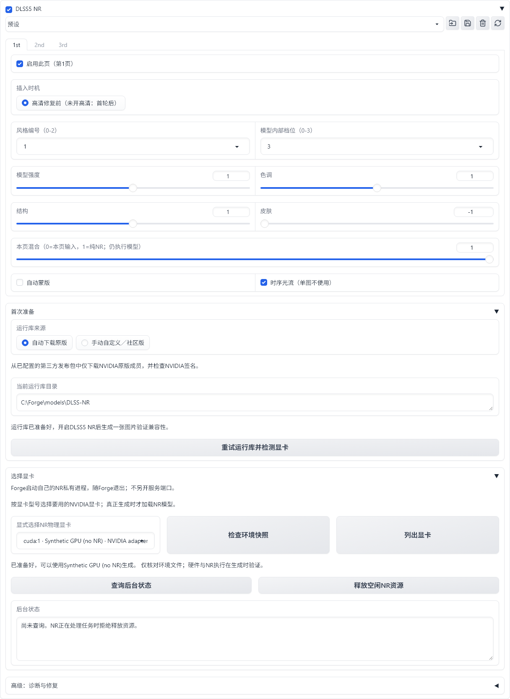

# DLSS5 NR for Forge

[English](README.md) | [逐步使用流程](docs/usage.zh-CN.md) | [运行库／模型准备](MODEL_SETUP.zh-CN.md)

面向 **64位 Windows + Forge-neo** 的实验性、非官方 NVIDIA Neural Rendering 插件。
支持最多三遍NR增强，各页独立启用和设参：文生图可选高清前后，图生图固定采样后执行。界面自动跟随Forge的语言设置，支持英文和简体中文，没有独立语言开关。
另有与文生图、图生图并列的 **DLSS5 NR独立增强页**，可直接上传图片增强，不经过扩散采样或VAE往返。



**自动运行库下载源：**第三方发布
[Magpie v0.6.6-experimental](https://github.com/SAOG0721/Magpie/releases/tag/v0.6.6-experimental)。
脚本下载该发布包，只解出`NVIDIA-Original/nvngx_dlssnr.dll`并检查NVIDIA签名；社区版不会自动安装。
手动文件有独立入口，见[运行库说明](MODEL_SETUP.zh-CN.md)。本项目Release只包含MIT桥接组件及许可声明，不包含NVIDIA运行库。

## 安装前确认

- 使用的是 **Forge-neo**，不是任意WebUI分支；Forge启动日志应显示Python **3.12或3.13**。
- 系统为64位Windows。先确认原来的文生图功能能正常生成图片。
- 已实测RTX5060Ti和原版运行库。40系需要自行选择社区兼容文件时可用手动模式，本项目尚未实测其兼容性；不要修改系统安全策略。

## 功能

- 顶层 **DLSS5 NR** 页可上传静图、直接增强、原图对照和下载PNG；参数与取消独立，不调用Forge全局停止，也不加载扩散模型。
- 标题栏复选框直接启停，收起时也能操作；关闭时不改变原生生成。
- **1st / 2nd / 3rd三页**各有独立开关、插入时机和参数，初始只启用第一页。
- 文生图先按页序执行高清前的启用页，再放大/高清采样，最后按页序执行高清后的启用页；无高清只能前置，均在ADetailer之前。
- **img2img图生图**有独立面板，在采样及latent回调后按页序增强，再交回原有修脸和蒙版回贴流程；嵌套ADetailer重绘不重复NR。
- 每页独立调风格/内部档位、强度、色调、结构、皮肤、自动蒙版和混合比例，也可复制上一页参数。
- 命名预设保存整组三页，XYZ开关/预设轴在网格开始前固定参数，各格不串参；不修改总开关和显卡。
- 显式选择物理显卡，不自动换卡或卸载其他模型。默认静图实测约0.5–0.9GiB，不保证满卡可用。
- 原生NR在Forge自己的隔离私有进程里执行，随Forge退出，不另开服务端口。
- 自动原版与手动自定义文件分目录保存；手动模式不自动下载、不替换用户文件，刷新和重启后保留选择。

## 安装

公开仓库地址（无需GitHub访问令牌）：

```text
https://github.com/silvermoong/sd-webui-forge-dlss5-nr.git
```

1. 打开Forge的 **Extensions（扩展）→ Install from URL（从网址安装）**。填写上面的仓库地址，
   其余字段保持默认，点击 **Install（安装）**。
2. 等安装结束，切到 **Installed（已安装）**，点击 **Apply and restart UI（应用并重启界面）**。
   不要在生成途中重启；浏览器F5不是这一步。下载依赖在点击安装时就会开始。
3. 回到 **txt2img（文生图）** 或 **img2img（图生图）**，展开 **DLSS5 NR**。**首次准备** 位于三页参数面板下方，默认 **自动下载原版** 会检查并准备缺少的运行库，
   下载时显示进度；下载中断可点 **重试运行库并检测显卡**。若提示缺少依赖，展开
   **高级：诊断与修复**，点击 **修复依赖并继续**；普通重试不会重装Python依赖。
4. 点击 **列出显卡**，在下拉框中按型号选自己的NVIDIA显卡。若刚点过“重试运行库并检测显卡”，
   直接选择即可。看见 **“已准备好，可以使用…生成”** 后继续。不会自动替你换卡。
5. 按下方“第一次测试”操作。Forge的“Installed”只代表源码进入了目录，不能替代第3、4步的就绪检查。

运行库保存在 **Forge模型目录的`DLSS-NR`子目录**；默认即`models/DLSS-NR`，自定义模型目录同样生效。
插件不改变Forge的PyTorch安装，不要求安装Visual Studio，不让其它应用卸载模型。

## 手动／社区运行库

1. 在参数面板下方的 **首次准备** 中，将“运行库来源”设为 **手动自定义／社区版**。切换后不会自动下载，刷新或重启也保留该选择。
2. 展开 **高级：诊断与修复**，选择自己的`nvngx_dlssnr.dll`，点击 **导入运行库副本**。
   也可以自行放入界面显示的目录，默认是`models/DLSS-NR/manual`，再点 **重试运行库并检测显卡**。
3. 选择要用的显卡，先测试一张。切回 **自动下载原版** 不会删除手动文件。

手动模式只检查本地Windows x64 DLL格式和复制完整性，**不验证NVIDIA签名，也不是安全扫描**。
请使用自己信任的文件。40系是否可用取决于所选社区版和驱动；导入成功不代表兼容性已验证。
切换与导入前必须确认本插件后台空闲，已有不同文件不会被静默覆盖。

## 第一次测试

选用你已经能正常出图的模型和提示词，设为 **512×512、批量大小1、批次数1**，暂时关闭高清修复和ADetailer。
只启用 **1st第一页**并保持默认参数，勾选DLSS5 NR标题栏总开关，再点击原来的 **Generate（生成）**。

成功后应有正常成图，图片生成参数中有`DLSS5 NR`记录且状态为`done`。仅出现NR面板或“文件已准备”不代表模型执行成功。
失败时关闭DLSS5 NR仍可按原流程出图；按准备区提示重试对应步骤，不要删除模型目录或重装整个Forge。
出现下载文件不可用时应检查发布源，不要重装Forge。

依赖修复会先关闭本插件已确认空闲的后台，再安装依赖；NR正在处理任务或无法确认空闲时拒绝修复。
准备区显示简短原因与下一步，原始错误可在高级选项的 **诊断信息** 中查看，准备成功后自动清空。

## 三页多遍增强

单遍测试成功后，打开 **2nd** 或 **3rd**，勾选该页开关，再设置本页参数与高清前/后位置。
各页既可用相同参数，也可分别调节。切页只切换编辑视图，不触发模型，也不决定只执行当前页。
禁用页保留参数但跳过执行；三页全关时，即使总开关打开也不运行NR。

文生图的执行顺序先看阶段，再看页号。例如第2页设为高清前，第1/3页设为高清后：

```text
首轮采样 → 第2页NR → 放大/高清采样 → 第1页NR → 第3页NR → 修脸/ADetailer
```

“复制上一页参数”复制参数与插入时机，不改变本页开关。**本页混合**相对本页输入计算，混合结果再送给下一页；设为0仍会执行模型。
整组使用同一运行库和显卡；同阶段中间图像保持float32，不逐遍保存PNG，阶段入口/出口仍为8位sRGB PNG。

新命名预设保存三页的参数、页开关和插入时机，**不保存总开关或环境**。旧单页预设载入第一页，另外两页恢复关闭的默认值。
三个入口的预设栏都常驻设置上方：一个可选择或输入名称的下拉框，后面依次是 **载入、保存/覆盖、删除、刷新列表** 四个方形图标，悬停可见说明。
选择已有名称后点击载入；新建时直接输入新名字再点保存，同名保存会覆盖。删除不清空当前参数；刷新只更新列表，方便读取其它页面保存的预设，不自动载入。
更多遍数会增加处理开销，也可能累计改变人物、材质与光照；三遍不保证更好，不等于强度乘三，建议从单遍开始对照。
更新已安装插件后，在任务空闲时重启Forge再刷新；仅按F5不会重新加载Python代码。

## 独立增强页

1. 打开与文生图、图生图并列的 **DLSS5 NR** 标签页。
2. 上传一张静态图片，在该页确认运行库就绪并选择NR显卡；运行库文件与私有后台仍与其它面板共用。
3. 先只启用 **1st**，或设置更多参数页，然后点击 **增强图片**。此处没有总开关、提示词或采样参数。
4. 对照 **输入图片** 与 **NR结果**，点击结果上的下载按钮取得PNG。

输入图片区合并上传与原图预览，上传后只显示一张原图和紧凑文件条。清除文件后恢复拖图区，同时清空旧预览、结果和回执。

处理链是 **上传像素 -> 按页序执行启用的NR参数页 -> PNG**，不经过图生图、扩散采样、VAE、缩放或修脸/ADetailer。
上传文件不被改写；按EXIF校正方向，内嵌颜色配置转换为sRGB，并保留透明通道。支持普通8位静图，最长边8192像素，
面积上限32 x 1024 x 1024像素；此页不支持动画、视频、HDR或批量上传。

命名预设共用，但高清前后位置只在当前控件中映射为直接处理，不改写保存的预设。
每次提交固定图片、参数与环境快照；**取消**只针对本浏览器会话的独立NR任务，不停止Forge生成或其它会话。
取消需要等待后台确认停止；状态未知时保留临时文件并报错，不冒充取消成功。开始新任务或失败后会清空旧结果与回执，全部页关闭时提示启用参数页。

下载PNG包含`DLSS5 NR`执行回执及`NR Parameters`参数记录，包括实际请求ID、运行库身份、尺寸、遍数和规范化输入像素摘要，
不复制原图的其它元数据。结果暂存在Gradio缓存，不自动写入Forge生成目录。2026-09-17另用RTX5060Ti通过512x512单遍/三遍、
零混合RGBA保持及真实Forge上传下载回执检查；这是功能验收，不是画质评测。

## 图生图与局部重绘

在 **img2img（图生图）** 页展开自己的 **DLSS5 NR** 面板并开启总开关。三页都固定为 **图生图后**，按页号执行启用页：

```text
原生输入准备 -> 图生图采样 -> latent回调 -> 第1/2/3页NR（仅启用页） -> 原有修脸/ADetailer与蒙版回贴
```

NR不预处理上传原图，也不修改重绘幅度；重绘幅度为0仍可能执行NR，Forge原有图像/VAE路径不变。
局部重绘保留Forge的裁剪、蒙版和回贴设置，NR处理采样后的图像或裁剪区域；开启原生回贴时由Forge恢复未蒙版内容。
一轮生成中的嵌套重绘不再次运行NR。

两页的总开关、参数和提交环境快照相互独立，运行库文件、私有后台和命名预设共用。
图生图载入含高清前后位置的预设时，所有页只在当前控件中改为图生图后，保存的预设不变；XYZ两条轴也可使用。
在一页切换共用的运行库来源后，先刷新界面再使用另一页；过期的执行环境快照会被拒绝。
除CPU和隔离浏览器外，已用RTX5060Ti、Anima2.9B/Qwen VAE完成512x512图生图的NR开关与硬蒙版重绘功能检查，未蒙版像素保持不变。
分块放大及另行创建顶层任务的特殊脚本尚未验收。

## 要求与边界

- Python3.12/3.13、64位Windows，针对Forge-neo；不承诺其它WebUI分支兼容。
- 已测试RTX5060Ti、驱动610.62和原版NVIDIA NR310.8.0.0。社区文件由用户自己安装，不自动选取；其它卡/驱动尚未认证。
- 读取Forge的`localization`设置；在Forge切换语言后重载界面即可，`zh_CN`和`zh-Hans`使用中文，
   英文与未支持的语言使用英文。语言只影响显示，预设不隐式开启总开关，也不切显卡。
- XYZ的 `[DLSS5 NR] Enabled` 可选Off/On，`Preset`选本插件保存的预设；只用预设轴时先勾NR。
- 单图不使用时序光流；数值档位是实验控制项，不是校准质量等级。增强可能改变身份、材质或光照，需人工看结果。
- 已验Anima/Qwen VAE、高清前后、同模型latent高清、batch和ADetailer；跨模型/VAE/refiner的latent前置拒绝。
- 不支持视频。图生图入口已做latent回调、批量、嵌套隔离、取消、回执及普通/高精度蒙版回贴函数的CPU检查，未做GPU画质验收。
- 错误不以原图直通冒充成功，不明接收/停止状态时保留本次临时目录。
- 三页公开版初次移植做了CPU与隔离英中浏览器验收；2026-09-17追加RTX5060Ti的小图GPU功能验收，不将其视为其它显卡或画质认证。

API脚本名仍为`DLSS5 NR`，新界面输入35项，保留原12项参数前缀，追加第一页开关和第2/3页完整参数。
旧12项解析仍支持；API应使用`script_args(spec, expanded=True)`明确发送全部页开关，避免依赖Forge保存的额外页默认值。
调用`/sdapi/v1/img2img`时，各页沿用`before_hr`线协议值表示唯一的图生图后阶段；启用页的`after_hr`会被拒绝，不新增协议参数。
成功回执的`count`仍为图片张数，另有实际`pass_count`及逐页阶段/张数；跨阶段标记为`mixed`。

源码/桥为MIT，保留[第三方归属](THIRD_PARTY_NOTICES.md)；NVIDIA运行库、模型和商标不在MIT授权范围内。
本项目未获NVIDIA、Forge或ComfyUI维护者背书。提交issue时不要附DLL、令牌或个人素材。